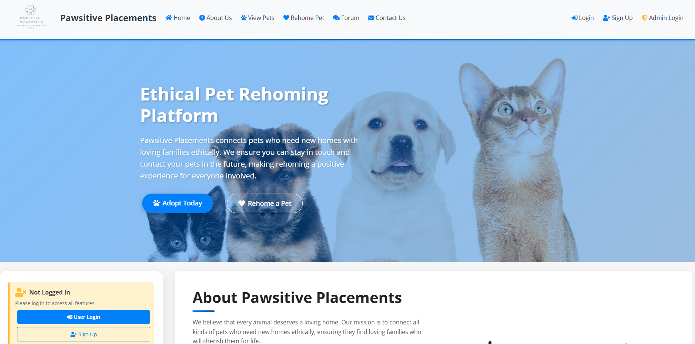
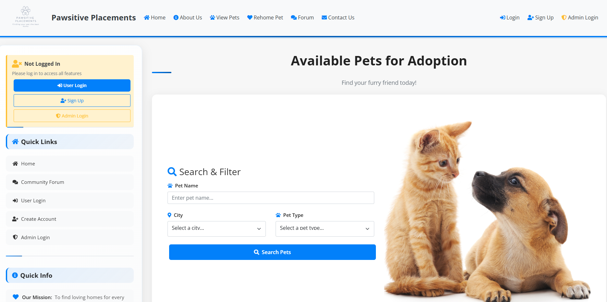
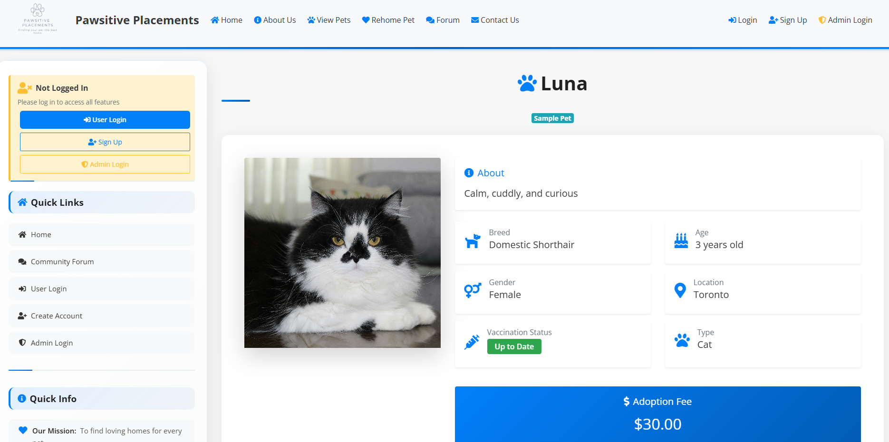
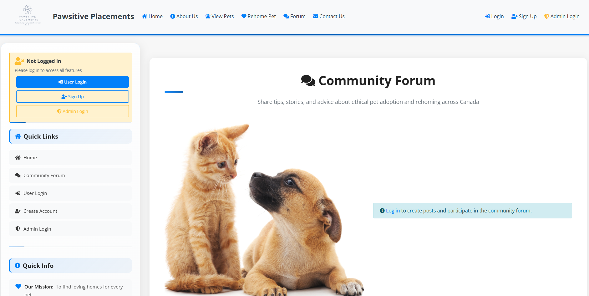

# Pawsitive Placements

**Full-stack PHP/MySQL pet adoption platform** | Production-ready | BC PIPA-compliant

[](https://www.php.net/)
[](https://mariadb.org/)
[](https://getbootstrap.com/)
[](LICENSE)
[](docs/TEST_REPORT.md)
[](#security-implementation)
[](database/schema.sql)


**Live Demo:** [www.pawsitiveplacements.ca](https://www.pawsitiveplacements.ca) | **Video Demo:** Coming Soon

> **Note:** Developed solo as a full-stack web application with complete backend, frontend, and database design. This is a proprietary, production-ready application. Source code is available for portfolio review upon request. See [Code Access](#code-access) section below.

---

## 📸 Screenshots

### Homepage

*Landing page featuring hero section, featured pets, and platform overview*

### Available Pets

*Pet listing page with advanced search, filtering, and pagination functionality*

### Pet Details

*Individual pet detail page with comprehensive information and adoption application form*

### Community Forum

*Community forum with categorized posts, user profiles, and engagement features*

---

## 🎯 What It Does

Production-ready pet adoption platform connecting pet owners with potential adopters across British Columbia. Features user management, advanced pet search, adoption applications, community forum, comprehensive admin panel, and enterprise-level SEO optimization.

**Impact:**
- Streamlines pet rehoming process with ethical standards
- Secure, user-friendly platform for pet adoption
- BC PIPA-compliant privacy implementation
- Enterprise SEO targeting 200-300% organic traffic growth

---

## 📊 By The Numbers

| Metric | Value |
|--------|-------|
| **Codebase** | 71 PHP files, 14,110+ lines |
| **Database** | 15+ normalized tables |
| **API Endpoints** | 10+ RESTful AJAX endpoints |
| **Admin Pages** | 20+ management interfaces |
| **Security** | 100% CSRF-protected, zero SQL injection vulnerabilities |
| **SEO** | Dynamic meta tags, JSON-LD structured data, XML sitemap |

---

## 🏗️ Architecture

**MVC Pattern with RESTful API Integration**

```
┌─────────────────┐
│  Frontend       │  Bootstrap 4.5 | jQuery | AJAX
│  (Views)        │
└────────┬────────┘
         │
┌────────▼────────┐
│  Controllers    │  PHP 8.2+ | Session Management
│  (Business      │
│   Logic)        │
└────────┬────────┘
         │
┌────────▼────────┐      ┌──────────────┐
│  Models         │◄────►│  Database    │
│  (PDO)          │      │  (MariaDB)   │
└────────┬────────┘      └──────────────┘
         │
┌────────▼────────┐
│  RESTful API     │  AJAX Endpoints | JSON Responses
│  (AJAX)         │
└─────────────────┘
```

**Key Design Decisions:**
- **MVC Separation:** Clean architecture for maintainability
- **PDO Prepared Statements:** 100% SQL injection prevention
- **CSRF Tokens:** All forms protected
- **Progressive Enhancement:** AJAX with traditional form fallbacks
- **SEO-First:** Dynamic meta tags, structured data per page

---

## 🛠️ Tech Stack

**Backend:** PHP 8.2+ | MariaDB/MySQL | PDO | RESTful API | Session Management

**Frontend:** Bootstrap 4.5.2 | jQuery 3.5.1 | AJAX | Font Awesome | Responsive Design

**Database:** 15+ normalized tables | Foreign keys | Indexes | Seed data

**SEO & Marketing:** Dynamic meta tags | JSON-LD structured data | XML sitemap | Social sharing | Newsletter system

**Security:** CSRF tokens | bcrypt hashing | PDO prepared statements | XSS prevention | File upload validation

**DevOps:** Apache .htaccess | Environment variables | Production-ready schema

---

## 🔒 Security Implementation

- ✅ **CSRF Protection:** Token-based validation on all forms
- ✅ **SQL Injection Prevention:** 100% PDO prepared statements (zero raw queries)
- ✅ **XSS Prevention:** `htmlspecialchars()` on all user output
- ✅ **Password Security:** bcrypt hashing with `password_hash()`
- ✅ **File Uploads:** MIME validation, size limits, random filenames
- ✅ **Session Security:** HttpOnly cookies, secure configuration, regeneration
- ✅ **Input Validation:** Server-side filtering with `filter_input()`
- ✅ **Privacy Compliance:** BC PIPA-compliant implementation

---

## 🗄️ Database Design

**Normalized relational database with 15+ tables, foreign key constraints, and optimized indexes.**

### Schema Overview
- **15+ Normalized Tables:** Users, pets, applications, forum posts, administrators, and more
- **Foreign Key Relationships:** Enforced referential integrity across all relationships
- **Indexed Columns:** Optimized queries on email, username, pet_id, user_id, and timestamps
- **Data Types:** Appropriate VARCHAR lengths, ENUM types for status fields, DECIMAL for fees
- **Character Set:** utf8mb4 for full Unicode support (emojis, international characters)

### Key Design Decisions
- **Normalization:** 3NF compliance prevents data redundancy
- **Foreign Keys:** CASCADE and SET NULL behaviors for data integrity
- **Indexes:** Strategic indexing on frequently queried columns (email, username, timestamps)
- **ENUM Types:** Status fields (account_status, pet_status) for data consistency
- **Timestamps:** Automatic `created_at` and `updated_at` tracking on all tables
- **Soft Deletes:** Status-based deletion (e.g., `account_status = 'banned'`) preserves audit trail

### Database Features
- User management with email verification and account status tracking
- Pet listings with vaccination status and adoption fee tracking
- Adoption application workflow with status management
- Community forum with posts, comments, and moderation
- User blocking and reporting system
- Contact form submissions with user association
- Newsletter subscription management
- Site visit counter with session-based tracking
- Rate limiting for spam prevention

**See:** `database/schema.sql` for complete schema documentation

---

## 🧪 Testing & Quality Assurance

**Comprehensive testing approach ensuring production-ready reliability.**

### Testing Methodology
- **Static Code Analysis:** PHP syntax validation, file structure verification
- **Security Audits:** CSRF protection, SQL injection prevention, XSS validation
- **Feature Testing:** All major features reviewed and verified
- **Database Integrity:** Schema validation, foreign key verification
- **Security Testing:** Password hashing, session management, input validation

### Test Coverage
✅ **User Management:** Registration, login, profile editing, password reset  
✅ **Pet Management:** Listing, search, filtering, detail views  
✅ **Adoption Flow:** Application submission, status tracking  
✅ **Forum System:** Post creation, comments, user interactions  
✅ **Admin Panel:** CRUD operations, user management, moderation  
✅ **Security:** CSRF tokens, prepared statements, XSS prevention  
✅ **File Uploads:** Image validation, MIME checking, size limits  
✅ **API Endpoints:** JSON responses, error handling, status codes  

### Quality Metrics
- **Code Quality:** Professional documentation, consistent structure, error handling
- **Security:** 100% CSRF-protected forms, zero SQL injection vulnerabilities
- **Performance:** Indexed queries, optimized database operations
- **Maintainability:** MVC architecture, separation of concerns, reusable components

**See:** `docs/TEST_REPORT.md` for detailed testing documentation

---

## 💼 Engineering Skills Demonstrated

- **Full-Stack Development:** PHP backend + Bootstrap frontend with MVC architecture
- **Database Design:** Normalized schema with 15+ tables, foreign keys, indexes
- **API Development:** RESTful AJAX endpoints with JSON responses
- **Security:** CSRF, SQL injection prevention, XSS protection, password hashing
- **SEO Optimization:** Dynamic meta tags, structured data (JSON-LD), sitemap generation
- **User Experience:** Responsive design, AJAX interactions, intuitive navigation
- **Admin Systems:** Comprehensive CRUD operations, user management, moderation
- **File Handling:** Secure uploads with validation and MIME checking
- **Code Quality:** Professional documentation, consistent structure, error handling
- **Testing:** Static analysis, security audits, feature verification

---

## 📁 Project Structure

```
PawsitivePlacements/
├── api/              # RESTful API endpoints
├── admins/           # Admin panel (20+ pages)
├── model/            # Database models (MVC)
├── pets/             # Pet listings & details
├── forum/            # Community forum
├── user/             # User account management
├── util/             # Utilities (SEO, CSRF, session)
├── database/         # Production-ready schema
└── view/             # Shared components
```

---

## 🚀 Quick Start

```bash
# 1. Clone repository
git clone <repository-url>
cd PawsitivePlacements

# 2. Import database/schema.sql
# 3. Configure database credentials
# 4. Start Apache/MySQL
# 5. Access: http://localhost/PawsitivePlacements/
```

**Default Admin:** `admin@pawsitiveplacements.ca` / `Admin123!` *(Change in production)*

---

## 🔐 Code Access

**This is proprietary software.** Source code is available for portfolio review and technical evaluation.

**For Recruiters & Hiring Managers:**
- ✅ **Portfolio Review:** Code available for technical skills assessment
- ✅ **Code Inspection:** Full codebase accessible for evaluation
- ✅ **Interview Discussion:** Project can be discussed in interviews
- 📧 **Request Access:** Contact info@lifesavertech.ca for repository access

**For Commercial Use:**
- This software is proprietary and available for licensing
- Commercial use, deployment, or distribution requires a license
- Licensing inquiries: Lifesaver Technology Services (info@lifesavertech.ca)

---

## 📄 License & Intellectual Property

**Intellectual Property:** This project was designed, created, and implemented by **Lindsey D. Stead** and is the intellectual property of Lindsey D. Stead.

**Copyright © 2025 Lindsey D. Stead. All Rights Reserved.**

**Portfolio Project** - This repository is for portfolio demonstration purposes only.

**For Recruiters & Hiring Managers:**
- ✅ **Portfolio Review:** Feel free to review this code for evaluation purposes
- ✅ **Code Inspection:** You may inspect the codebase to assess technical skills
- ✅ **Interview Discussion:** This project can be discussed in interviews

**For Commercial Use:**
- This software is proprietary and available for licensing upon request
- Commercial use, deployment, or distribution requires a license
- **Licensing inquiries:** Lifesaver Technology Services (info@lifesavertech.ca)

---

**Built with ❤️ for ethical pet adoption and rehoming in British Columbia, Canada.**


